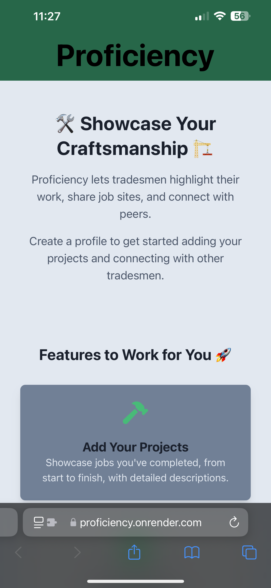

# Proficiency

---

## Description

Proficiency is a social media platform and a tool for tradespeople, creators, artists, and more to collaborate and share things they've done in their profession.
My motivation for creating this project stems from my career as a construction professional always in need of a place to save and share all the places I have built.
Users of Proficiency could also be artists sharing locations of all the murals they've done, or a road pavers wanting to display all the roads they've paved.

## Table of Contents

- [Screenshots](#screenshots)
- [Installation](#installation)
- [Usage](#usage)
- [Credits](#credits)
- [License](#license)

## Screenshots

## Installation

To check out the project's inner workings and edit for your own fun, clone the repository to your local computer. Then run `npm install` in your terminal from the project directory.

## Usage

Visit my live deploy at: [Render](https://proficiency.onrender.com)

## Credits

- Jacob Garland, Creator [Github](https://github.com/Jacob-Garland)

## License

This project is licensed under the MIT License. For more details, please refer to the LICENSE file.
